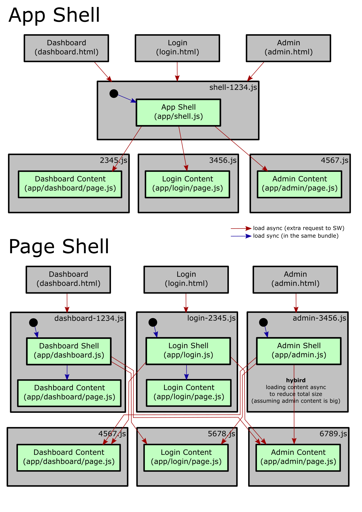

# webpack-pwa

Super simple webpack PWA(Progressive Web App) example featuring

* Routing with **On Demand Loading**
* Offline support
* Fetching some data from network
* Two approaches
  * App Shell
  * Page Shell
* By intent: No framework, only simple JavaScript and DOM
  * Yes with `innerHTML` and `innerText`
  * Feel free to imagine your favorite framework here.

## Build and Run it

``` shell
npm install
npm run build-shell
cd dist
npm install node-static -g
static
open http://localhost:8080/dashboard.html
```

This builds the App Shell version.

To build the Page Shell version: replace `npm run build-shell` with `npm run build-page`.

## Architecture



### App Shell

* Total size is smaller
* Initial load requests three files: `login.html`, `shell-1234.js`, `3456.js`
* Initial load needs to load: Shell + Router + content
* The shell is visible earlier than with Page Shell approach.

### Page Shell

* Total size is bigger (i. e. dashboard content is in `dashboard-1234.js` and `4567.js`)
  * App takes longer to be offline ready.
* Initial load requests only two files: `login.html`, `login-2345.js`
* Initial load needs to load: Shell + content
* The shell + content is visible earlier than with App Shell approach.

A hybrid approach can be used where shell and content is separated in two requests (see admin page as example). This makes sense when content is much bigger than shell and shell should be visible earlier.

https://github.com/webpack/webpack-pwa
